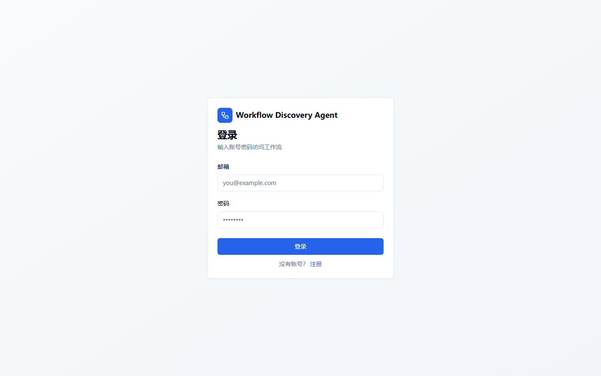
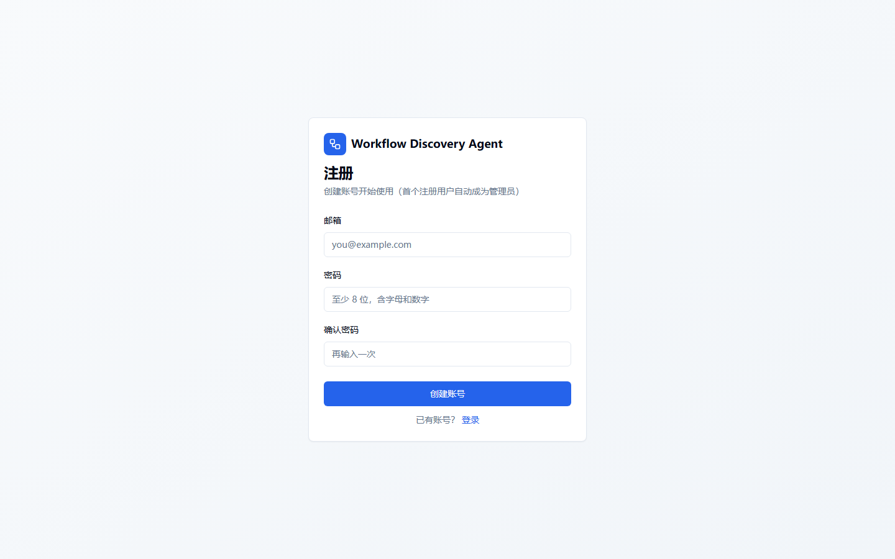
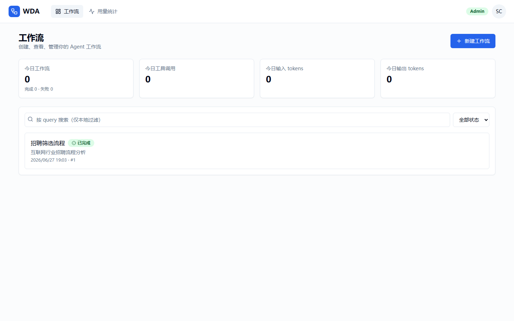
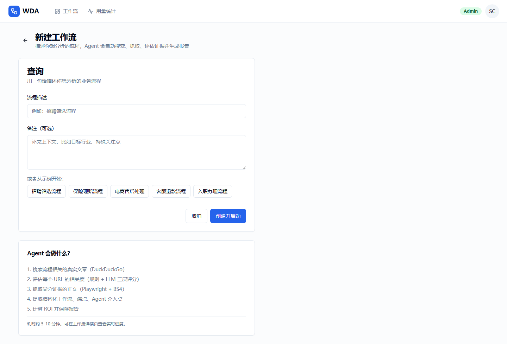
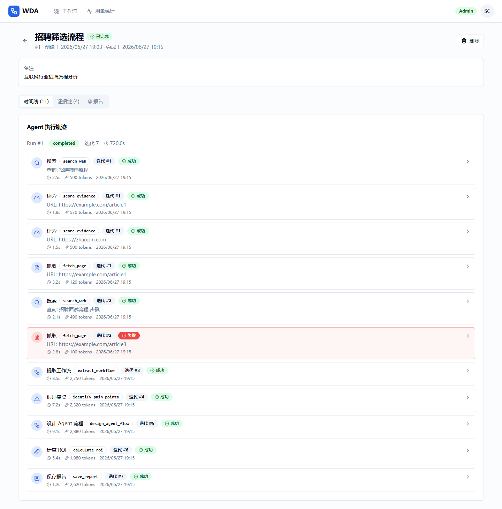
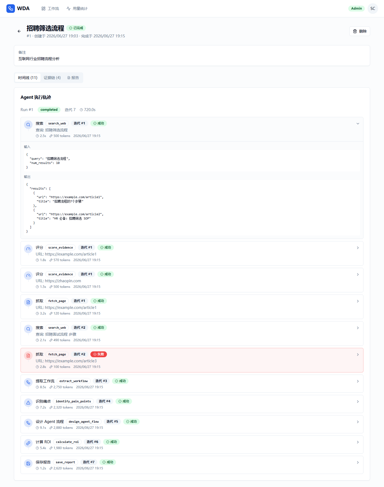
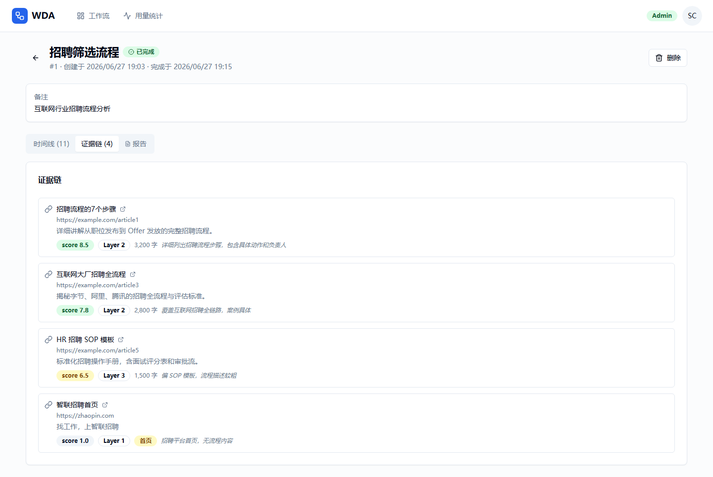
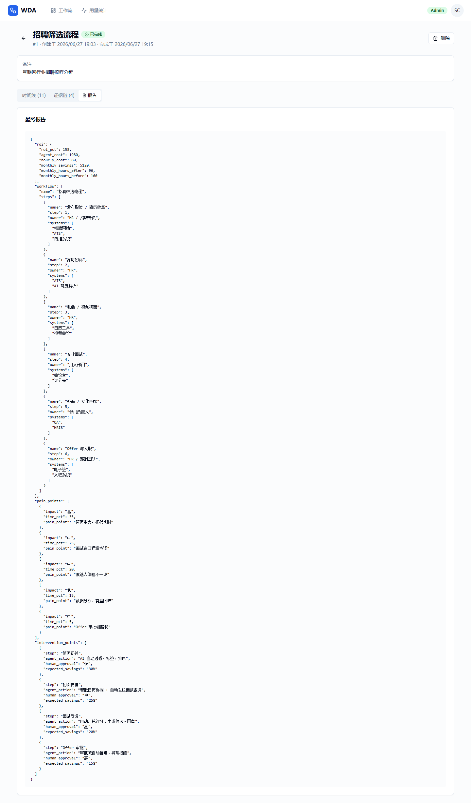
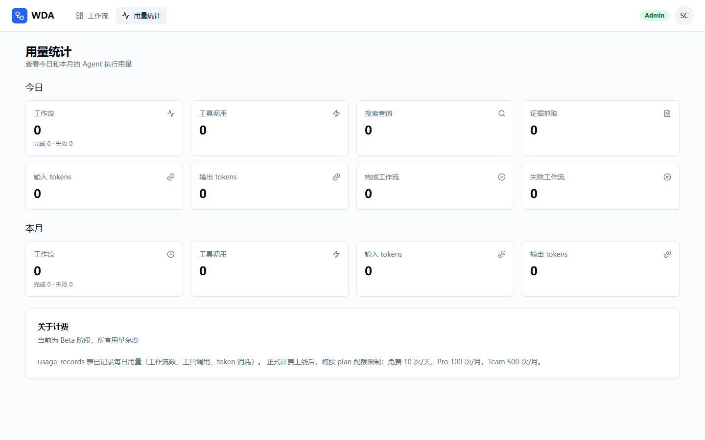
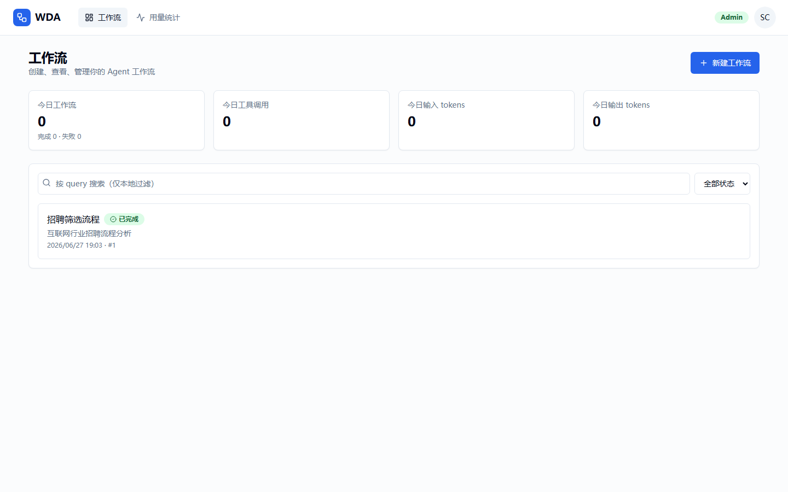

# 产品页面介绍

本文档介绍 Workflow Discovery Agent 前端各页面的功能和亮点。截图见 `docs/screenshots/` 目录。

---

## 1. 登录页 `/login`

**功能**：
- 邮箱 + 密码登录
- 表单校验（邮箱格式、密码长度）
- 登录成功跳转 Dashboard
- 失败显示错误提示（不区分用户不存在/密码错，防枚举）

**技术亮点**：
- react-hook-form + zod 校验
- Token 存 Zustand persist store（localStorage）
- 401 自动触发 refresh token 换新

---

## 2. 注册页 `/register`

**功能**：
- 邮箱 + 密码 + 确认密码
- 密码强度校验（至少 8 位，含字母和数字）
- 两次密码一致校验
- 首个注册用户自动成为 admin（提示文案说明）
- 注册成功直接登录跳转 Dashboard

**业务规则**：
- 第一个用户 → admin
- 后续用户 → member
- 重复邮箱 → 409 错误

---

## 3. Dashboard 工作流列表 `/dashboard`

**功能**：
- **用量卡片**：今日工作流数、工具调用、输入/输出 tokens
- **工作流列表**：分页展示，按创建时间倒序
- **状态过滤**：全部/排队中/运行中/已完成/失败
- **状态徽章**：彩色图标 + 文字（排队灰/运行蓝转圈/完成绿勾/失败红叉）
- **新建按钮**：跳转创建页
- **自动刷新**：列表 5 秒轮询，用量卡片 10 秒轮询

**交互**：
- 点击列表项 → 跳转工作流详情
- 分页（每页 20 条）

---

## 4. 新建工作流页 `/workflows/new`

**功能**：
- 流程描述输入框（3-255 字符）
- 备注文本框（可选，最多 2000 字符）
- **示例按钮**：5 个行业示例（招聘筛选/保险理赔/电商售后/客服退款/入职办理），点击填充
- **Agent 工作流说明**：展示 Agent 会执行的 5 步操作
- 提交后跳转详情页，Agent 开始异步执行

**校验**：
- query 必填，3-255 字符
- notes 可选，最多 2000 字符

---

## 5. 工作流详情页 `/workflows/:id`（核心页面）

**功能**：
- **顶部信息栏**：query + 状态徽章 + ID + 创建/完成时间
- **进度条**：运行中显示进度百分比 + 当前迭代 + 工具调用次数
- **错误提示**：失败时红色卡片显示 error 详情
- **Tabs 切换**：时间线 / 证据链 / 报告

### 5.1 时间线 Tab（Agent 执行可视化）

**这是产品的核心卖点**。把 `tool_calls` 表的执行轨迹渲染成垂直时间线：

- **每个 tool_call 一张卡片**：
  - 图标（搜索/评分/抓取/提取/保存等 8 种）
  - 工具名 + 中文名 + 迭代号
  - 成功/失败徽章
  - 输入摘要（如 URL、查询关键词）
  - 耗时 + token 数 + 时间戳
- **点击展开**：显示完整输入 JSON + 输出 JSON
- **垂直连线**：卡片之间用线连接，体现执行顺序
- **失败高亮**：红色边框 + 红色背景

**实时刷新**：运行中每 2 秒轮询，新 tool_call 自动追加。

### 5.2 证据链 Tab

**功能**：
- 按 score 降序展示所有证据
- 每条证据显示：
  - 标题 + URL（可点击新窗口打开）
  - snippet 摘要
  - **score 徽章**：≥7 绿色 / 4-6 黄色 / <4 灰色
  - **Layer 徽章**：1/2/3 表示哪层评分
  - 首页/歧义标记
  - 字数 + 评分理由

### 5.3 报告 Tab

**功能**（仅 workflow 完成时显示）：
- 展示 `final_output` JSON
- 包含：工作流步骤、痛点、Agent 介入点、ROI 计算

---

## 6. 用量统计页 `/usage`

**功能**：
- **今日用量**：8 个指标卡片
  - 工作流（开始/完成/失败）
  - 工具调用次数
  - 搜索查询次数
  - 证据抓取次数
  - 输入/输出 tokens
- **本月用量**：4 个汇总卡片
- **计费说明**：当前 Beta 免费，未来按 plan 配额

**自动刷新**：今日 10 秒，本月 30 秒。

---

## 7. 顶栏导航

**功能**：
- Logo + 应用名
- 导航：工作流 / 用量统计
- Admin 徽章（仅 admin 用户显示）
- 用户头像下拉菜单：
  - 邮箱 + 角色
  - 退出登录按钮

---

## 截图说明

截图文件放在 `docs/screenshots/` 目录，命名格式 `序号-页面名.png`。

由于 Claude Code 无法直接截图浏览器，需要人工操作：

1. 启动完整应用（后端 + Celery + 前端）
2. 打开 http://localhost:5173
3. 按上述顺序访问各页面
4. 用浏览器截图工具（或系统快捷键）截图
5. 保存到 `docs/screenshots/`，文件名对应上表

**推荐工具**：
- Chrome DevTools → Capture screenshot（全页）
- 或 Windows 截图工具（Win + Shift + S）

**建议分辨率**：1440×900（适合 README 展示）
